# 🐱 Cats — Frontend

<div align="center">

**Rede social feita para gatos**

Uma rede social moderna e responsiva onde donos podem cadastrar seus gatos, compartilhar fotos e interagir com a comunidade.


</div>

---

## 📖 Sobre

Este é o **frontend** da rede social **Cats** — uma plataforma completa onde apaixonados por gatos podem criar perfis para seus gatos, compartilhar fotos, curtir, comentar e explorar publicações de toda a comunidade.

O projeto foi desenvolvido com **Next.js 16** (App Router), **React 19**, **TypeScript** e **Tailwind CSS 4**, aproveitando recursos modernos como **Server Actions**, **Parallel Routes**, **Intercepting Routes**, **React Compiler**, **useOptimistic** e **feed infinito com scroll**.

O backend é uma API REST construída separadamente com **Express**, **Prisma** e **PostgreSQL**. As imagens são hospedadas no **Cloudinary**.

---

### 🏠 Homepage

Landing page com hero imersivo, seções de funcionalidades, como funciona, comunidade e CTAs para criação de conta.

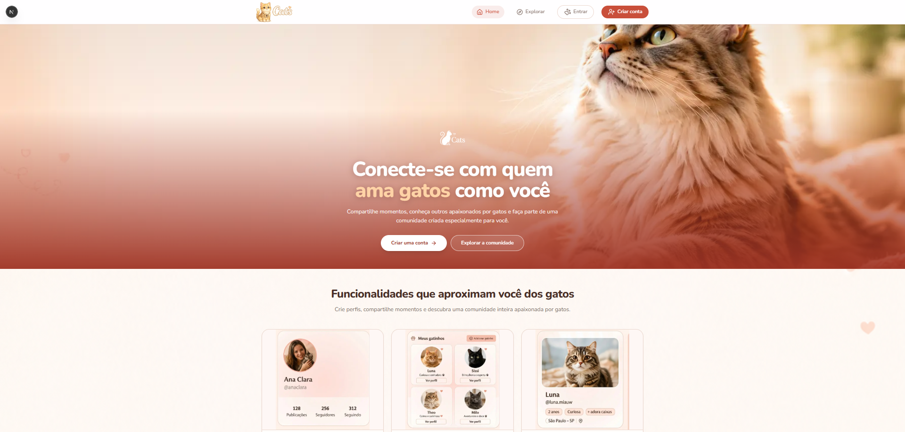

---

### 📰 Feed (Explorar)

Feed infinito com cards de posts, likes otimistas, comentários inline, sidebar lateral e carregamento progressivo.

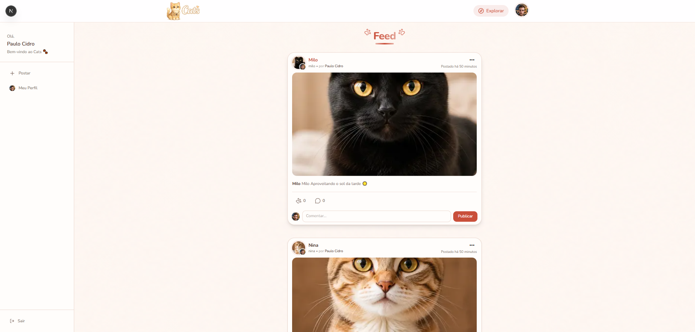

---

### 🔑 Login

Tela de login com validação de campos, feedback de erros, loading animado e opção de visualizar senha.

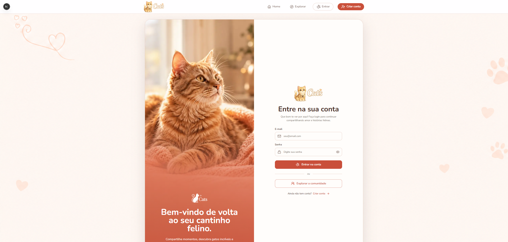

---

### 📝 Criar Conta

Formulário de registro com validação completa (nome, email, senha), feedback visual e redirecionamento automático.

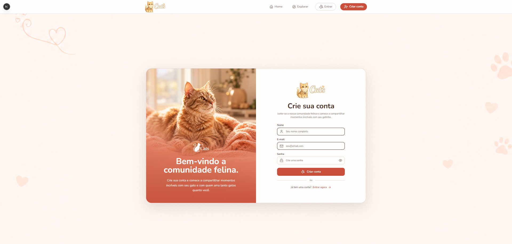

---

### 🐈 Criar Gato

Dialog modal para cadastrar um novo gato com upload de foto, nome, data de nascimento, username e bio.

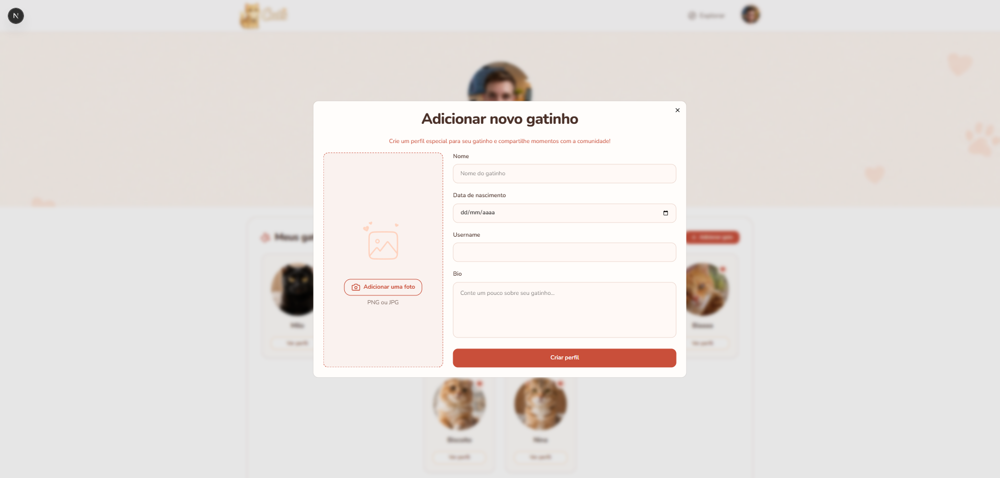

---

### 👤 Perfil Humano

Página de perfil do tutor com avatar, listagem de seus gatos cadastrados e galeria de fotos dos posts.

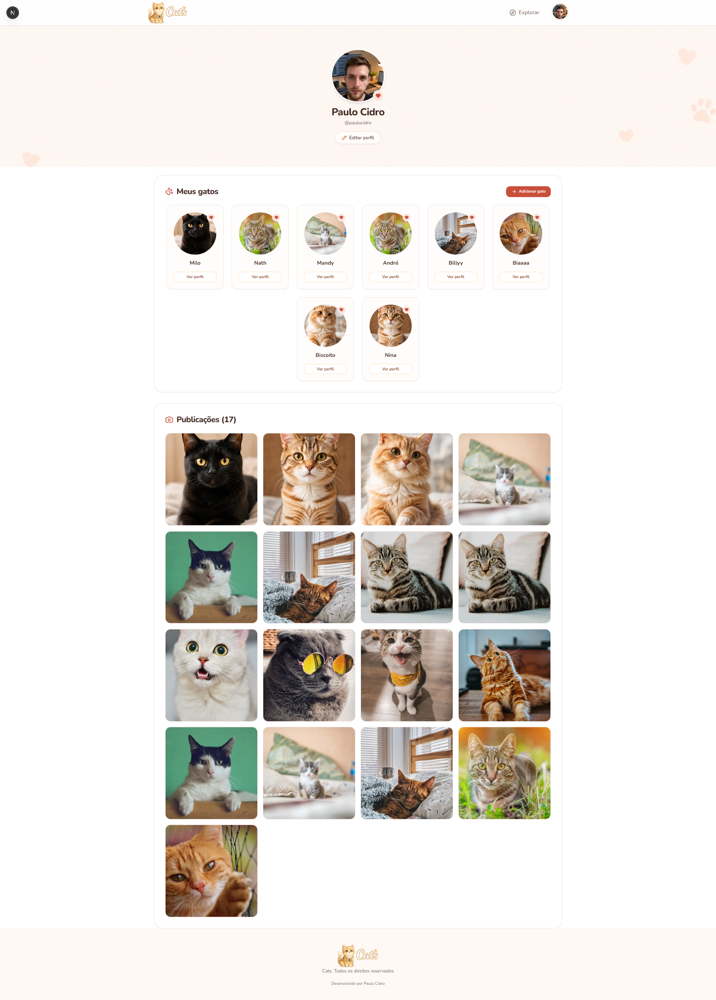

---

### 🐾 Perfil do Gato

Página de perfil individual do gato com avatar, bio, username e galeria de fotos dos posts associados.

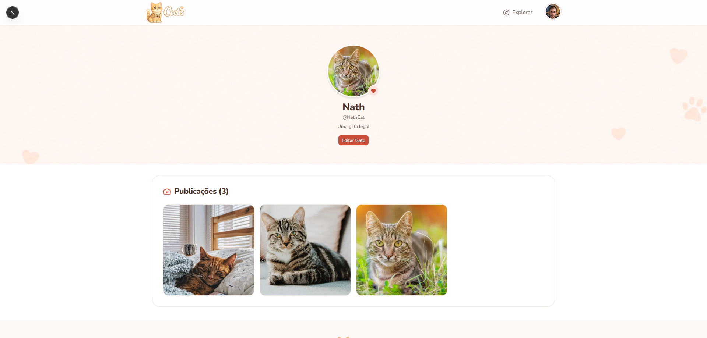

---

### ✏️ Editar Gato

Dialog modal para edição do perfil do gato com atualização de foto, nome, data de nascimento, username e bio.

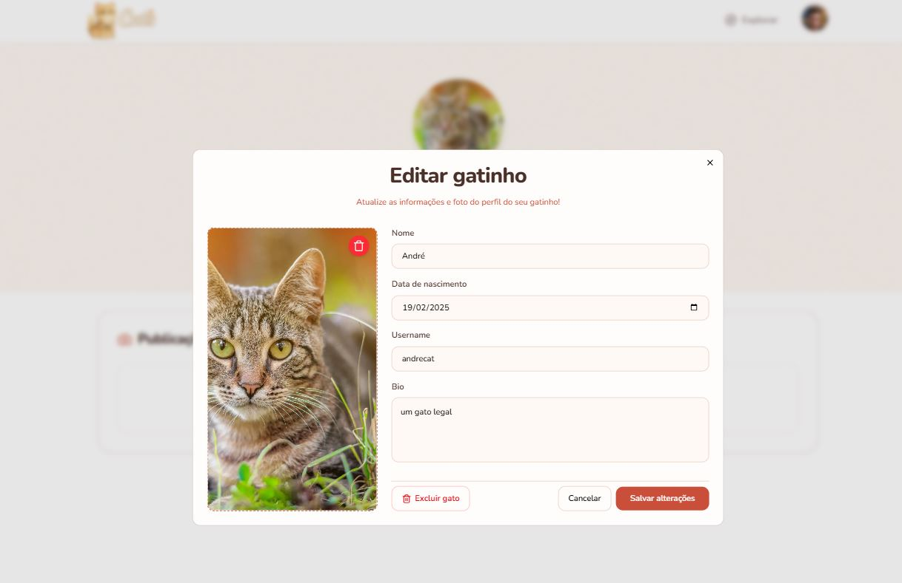

---

### 🗑️ Excluir Gato (Modal)

Modal de confirmação para exclusão do gato, com feedback visual e proteção contra ações acidentais.

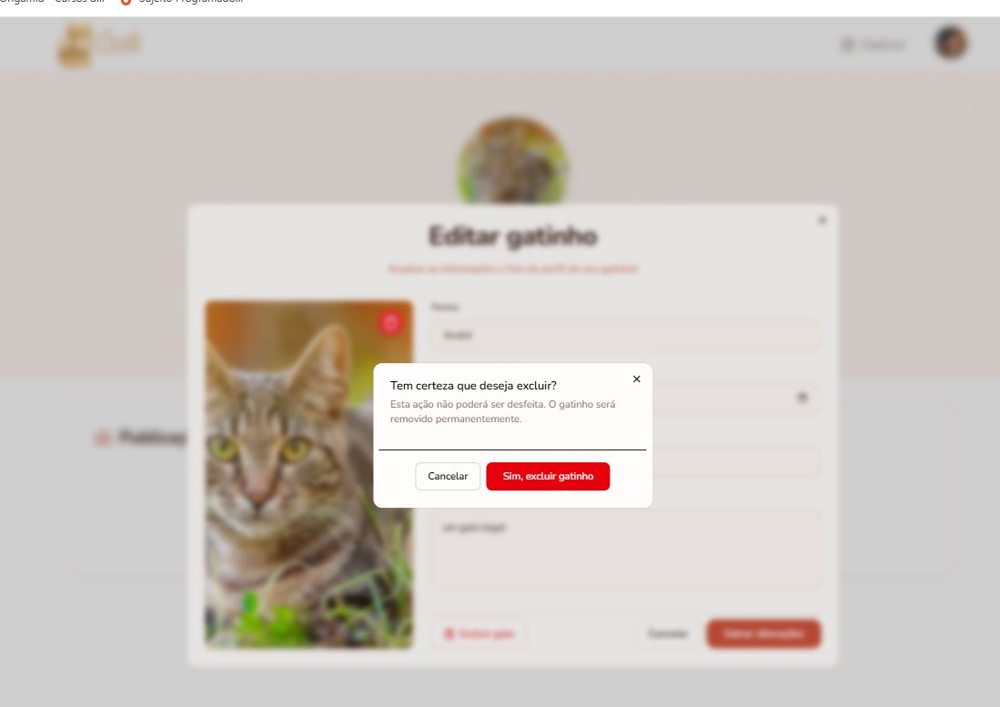

---

### 💬 Comentários no Post

Seção de comentários com avatar do usuário, formulário inline para novo comentário e menu de ações.

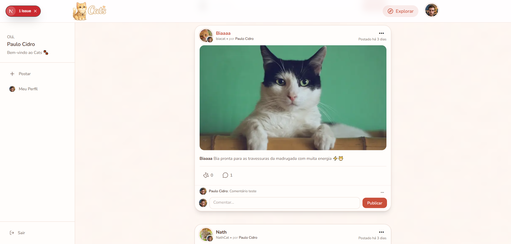

---

### ✏️ Editar Comentário

Dialog para edição de comentário existente com campo de texto.

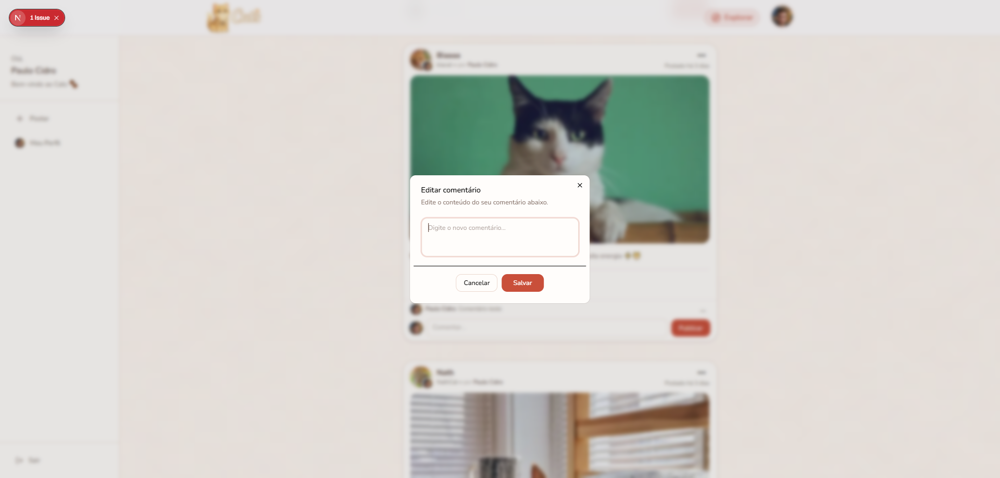

---

### 🗑️ Excluir Comentário (Modal)

Modal de confirmação para exclusão de comentário com proteção contra ação acidental.

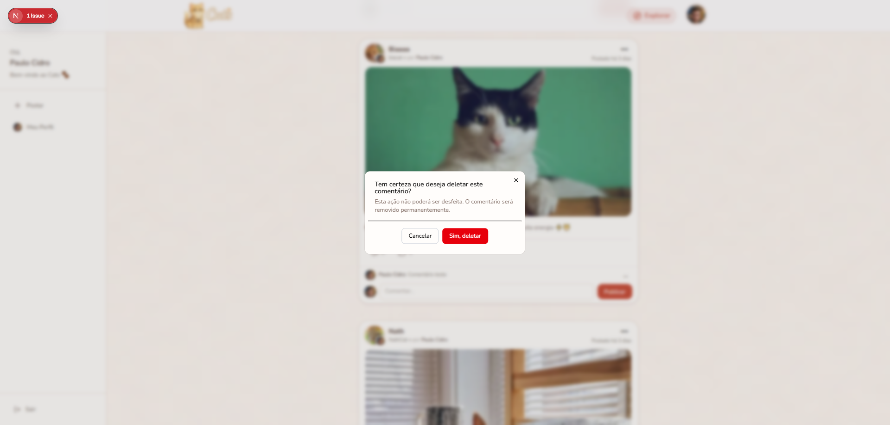

---

## ✨ Funcionalidades

| Landing page completa |
| Autenticação com JWT |
| Feed infinito com carregamento progressivo |
| CRUD de posts com upload de imagens |
| Sistema de likes otimista com `useOptimistic` |
| Sistema de comentários |
| CRUD de gatos com upload de avatar |
| Perfis de tutor e gato com galeria de posts |
| Rotas paralelas e interceptação de rotas |
| Post em modal e página dedicada |
| Design responsivo e mobile-first |
| Tratamento de erros e feedbacks ao usuário |

## 🛠️ Tech Stack

| Tecnologia                                    | Uso                                                            |
| --------------------------------------------- | -------------------------------------------------------------- |
| [Next.js 16](https://nextjs.org/)             | Framework React com App Router, Server Actions, React Compiler |
| [React 19](https://react.dev/)                | Biblioteca UI com `useOptimistic`, `useActionState`            |
| [TypeScript](https://www.typescriptlang.org/) | Tipagem estática                                               |
| [Tailwind CSS 4](https://tailwindcss.com/)    | Estilização utility-first responsiva                           |
| [shadcn/ui](https://ui.shadcn.com/)           | Componentes de UI (Dialog, Button, Input, Label)               |
| [Lucide React](https://lucide.dev/)           | Ícones SVG                                                     |
| [Sonner](https://sonner.emilkowal.dev/)       | Toast notifications                                            |
| [Cloudinary](https://cloudinary.com/)         | Hospedagem de imagens (via backend)                            |

---

## 📁 Estrutura do Projeto

```
frontend/
├── docs/                           # Screenshots da aplicação
├── public/                         # Assets estáticos (imagens, logo)
├── src/
│   ├── actions/                    # Server Actions (comunicação com a API)
│   │   ├── cat/                    # CRUD de gatos
│   │   ├── comment/                # CRUD de comentários
│   │   ├── like/                   # Toggle de curtida
│   │   ├── post/                   # CRUD de posts + feed paginado
│   │   └── user/                   # Auth (login, register, logout, perfil)
│   ├── app/                        # App Router (páginas e layouts)
│   │   ├── @post/                  # Parallel Route (modal de post)
│   │   │   ├── (.)post/[id]/       # Intercepting Route
│   │   │   └── default.tsx
│   │   ├── cats/[id]/              # Perfil do gato
│   │   ├── explorar/               # Feed principal + layout com sidebar
│   │   ├── login/                  # Página de login
│   │   ├── post/[id]/              # Página dedicada do post
│   │   ├── profile/[username]/     # Perfil do tutor
│   │   ├── register/               # Página de registro
│   │   ├── layout.tsx              # Layout raiz (Header, Footer, Toaster)
│   │   ├── loading.tsx             # Loading global com animação
│   │   └── page.tsx                # Homepage (landing page)
│   ├── components/                 # Componentes reutilizáveis
│   │   ├── comments/               # Formulário de comentários
│   │   ├── dialogs/                # Modais (criar/editar/excluir gato, post, comentário)
│   │   ├── explorar/               # Feed, FeedPhotos, PostCard, Sidebar
│   │   ├── header/                 # Header desktop + mobile
│   │   ├── home/                   # Seções da landing page
│   │   ├── login/                  # Formulário de login
│   │   ├── post/                   # Componente de post específico
│   │   ├── postar/                 # Formulário para criar post
│   │   ├── profile/                # Perfil (MyCats, ProfilePhotos, EditProfile)
│   │   ├── register/               # Formulário de registro
│   │   └── ui/                     # Componentes base (Button, Input, Dialog, Loading)
│   ├── context/                    # Context API (UserContext)
│   ├── hooks/                      # Custom hooks (useMobile)
│   ├── lib/                        # Utilitários (cn)
│   ├── types/                      # TypeScript types (Post, Cat, Comment)
│   └── utils/                      # Utilitários (apiClient, apiError, cookies, formatTime)
├── components.json                 # Configuração do shadcn/ui
├── next.config.ts                  # Configuração do Next.js (React Compiler, Cloudinary)
├── package.json
├── postcss.config.mjs
├── tailwind.config.ts
└── tsconfig.json
```

---

## 🖧 Backend (API)

A API REST que alimenta esta aplicação foi desenvolvida separadamente com **Node.js**, **Express**, **TypeScript**, **Prisma ORM** e **PostgreSQL**.

Principais responsabilidades do backend:

- **Autenticação & Segurança**: Emissão e validação de tokens JWT, senhas criptografadas com bcrypt.
- **Upload de Mídias**: Integração com **Cloudinary** + **Multer** para armazenamento e otimização das fotos de gatos, posts e avatares.
- **Modelagem Relacional**: Gestão de entidades (usuários/tutores, gatos, postagens, likes e comentários).
- **Validação & Tratamento de Erros**: Schemas com **Zod** e middleware centralizado com `AppError`.

👉 Acesse o repositório completo do backend em: **[github.com/pcidro/Cats](https://github.com/pcidro/Cats)**

---

## 🚀 Como Rodar

### Pré-requisitos

- [Node.js](https://nodejs.org/) (v18 ou superior)
- Backend da aplicação rodando ([ver README do backend](https://github.com/pcidro/Cats))

### Instalação

1. **Clone o repositório e acesse a pasta do frontend:**

```bash
git clone https://github.com/pcidro/Cats-Front
cd Cats/frontend
```

2. **Instale as dependências:**

```bash
npm install
```

3. **Configure as variáveis de ambiente:**

Crie um arquivo `.env.local` na raiz do frontend:

```env
NEXT_PUBLIC_URL=http://localhost:3333
```

4. **Inicie o servidor de desenvolvimento:**

```bash
npm run dev
```

O frontend estará rodando em `http://localhost:3000`.

---

## 📜 Scripts Disponíveis

| Script  | Comando         | Descrição                            |
| ------- | --------------- | ------------------------------------ |
| `dev`   | `npm run dev`   | Inicia o servidor de desenvolvimento |
| `build` | `npm run build` | Gera o build de produção             |
| `start` | `npm run start` | Inicia o servidor de produção        |
| `lint`  | `npm run lint`  | Executa o ESLint                     |

---

## 🎨 Design System

O projeto utiliza um design system customizado construído com **Tailwind CSS 4** e variáveis CSS:

| Token                  | Cor       | Uso                                        |
| ---------------------- | --------- | ------------------------------------------ |
| `--primary`            | `#c94f3a` | Cor principal (botões, links, destaques)   |
| `--primary-foreground` | `#ffffff` | Texto sobre a cor primária                 |
| `--secondary`          | `#fbe2da` | Backgrounds secundários e destaques suaves |
| `--accent`             | `#f2a68e` | Cor de acento                              |
| `--background`         | `#fff9f6` | Fundo geral da aplicação                   |
| `--surface`            | `#fffdfb` | Cards e superfícies elevadas               |
| `--foreground`         | `#4a3028` | Texto principal                            |
| `--muted-foreground`   | `#816d65` | Texto secundário/desabilitado              |
| `--border`             | `#ecd8cf` | Bordas e separadores                       |
| `--destructive`        | `#c84c4c` | Ações destrutivas (excluir)                |

**Tipografia**: [Nunito](https://fonts.google.com/specimen/Nunito) (headings) + [Nunito Sans](https://fonts.google.com/specimen/Nunito+Sans) (body)

---

## 🧠 Aprendizados

- **Integração completa do frontend e do backend** Utilizando Server Actions como camada intermediária entre o frontend Next.js e a API REST Express.

- **Implementação do frontend responsivo usando Tailwind CSS**, com design mobile-first, header adaptável (desktop com menu dropdown + mobile com barra de navegação inferior) e layouts que se ajustam fluidamente a qualquer tamanho de tela.

- **Utilização do `useOptimistic`** para atualizar os likes instantaneamente na interface, proporcionando uma experiência de usuário imediata enquanto a requisição ao backend acontece em background.

- **Utilização de rotas paralelas e interceptação de rotas** (`@post` e `(.)post`) do Next.js App Router, permitindo que posts sejam abertos em modal ao navegar pelo feed, mantendo o scroll e contexto, enquanto URLs diretas renderizam a página dedicada completa.

- **Adição de feed infinito** Carregando progressivamente mais posts à medida que o usuário rola a página, melhorando a performance e a experiência de navegação.

- **Loading com animação elegante** que se estende por todo o site, utilizando um componente customizado que aparece tanto no carregamento global de páginas quanto nos estados de pending de formulários.

- **Tratamento de erros massivo e abrangente**, tanto no backend (com `AppError` customizado, middleware global de erros) quanto no frontend (com `apiError` helper, validação de formulários field-by-field, try/catch em Server Actions, feedback visual com toasts e mensagens inline).

---

## 🔮 Melhorias Futuras

- Adicionar opção de **seguir e parar de seguir** outros usuários.
- Adicionar fluxo de **"Perdeu a conta? Esqueci a senha"** com recuperação via email.
- Adicionar sistema de **notificações** (likes, comentários, novos seguidores).
- Melhorar a velocidade do site no geral.

---
